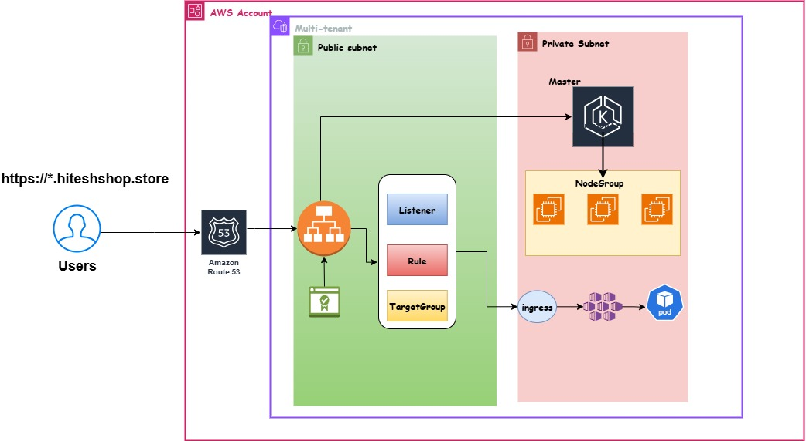

# Multi-Tenant EKS Infrastructure

This repository provisions a modular, secure, multi-tenant Kubernetes infrastructure on AWS using Terraform, Amazon EKS, and Helm. Each tenant is isolated at the namespace level. Workloads are deployed via Helm using per-tenant configuration files.

The platform is designed with production best practices, including private EKS access and a bastion host for secure administrative operations.

---

## Directory Structure

```
multi-tenant/
├── 01-vpc/                 # VPC, subnets, routing
├── 02-sg/                  # Security groups
├── 03-eks/                 # EKS cluster and node groups
├── 04-bastion/             # Bastion host for secure kubectl access
├── helm-chart/             # Helm chart templates
├── tenants/                # Per-tenant Helm configuration
│   ├── tenant1/
│   └── tenant2/
└── .gitignore
```

---

## Prerequisites

Ensure the following tools are installed and configured:

- Terraform CLI (>= 1.5)
- AWS CLI (with appropriate IAM permissions)
- kubectl
- Helm (v3 or above)
- jq (optional)

---

## Infrastructure Deployment Steps

### 1. Provision the VPC

```bash
cd 01-vpc
terraform init
terraform apply -auto-approve
```

### 2. Deploy Security Groups

```bash
cd ../02-sg
terraform init
terraform apply -auto-approve
```

### 3. Deploy the EKS Cluster

```bash
cd ../03-eks
terraform init
terraform apply -auto-approve
```

### 4. Deploy Bastion Host

The bastion host is required to manage the EKS cluster securely from inside the VPC. This host is where `kubectl`, `aws`, and `helm` are installed and used for cluster administration and tenant deployments.

```bash
cd ../04-bastion
terraform init
terraform apply -auto-approve
```

---

## Configuring Bastion Host for Kubernetes Access

SSH into the bastion host:

```bash
ssh -i <your-private-key.pem> ec2-user@<bastion-public-ip>
```

Inside the bastion host:

1. Install AWS CLI, kubectl, and helm (optional if not done via user_data).
2. Configure kubeconfig:

```bash
aws eks update-kubeconfig --region <region> --name <eks-cluster-name>
```

3. Test access:

```bash
kubectl get nodes
```

---

## Onboarding a New Tenant

### 1. Create a New Tenant Directory

```bash
mkdir tenants/tenant3
cp tenants/tenant1/values.yaml tenants/tenant3/
cp tenants/tenant1/helm-install.sh tenants/tenant3/
```

### 2. Customize Tenant Configuration

Edit `tenants/tenant3/values.yaml`:

```yaml
namespace: tenant3
replicaCount: 2

image:
  repository: your-container-image
  tag: latest

```

---

## Deploying Tenant Workloads from Bastion

SSH into the bastion and run:

```bash
cd tenants/tenant3
chmod +x helm-install.sh
./helm-install.sh
```

---

## Sample `helm-install.sh` Script

```bash
#!/bin/bash

TENANT=tenant3
NAMESPACE=$TENANT

# Create namespace if it does not exist
kubectl create ns $NAMESPACE --dry-run=client -o yaml | kubectl apply -f -

# Install or upgrade the Helm chart
helm upgrade --install $TENANT ../../helm-chart   -f values.yaml   -n $NAMESPACE
```

---

## Features

- Modular Terraform infrastructure with environment separation
- Private multi-AZ VPC setup
- Secure EKS provisioning with managed node groups
- Namespace-based tenant isolation
- Per-tenant Helm-based deployment
- Bastion host for controlled access to the Kubernetes cluster

---

## Security Considerations

- The EKS cluster is deployed in **private subnets** and accessed only through a **bastion host**.
- IAM roles and security groups are scoped per environment.
- Access to each tenant’s workloads is isolated via Kubernetes namespaces.

---
## Architecture

